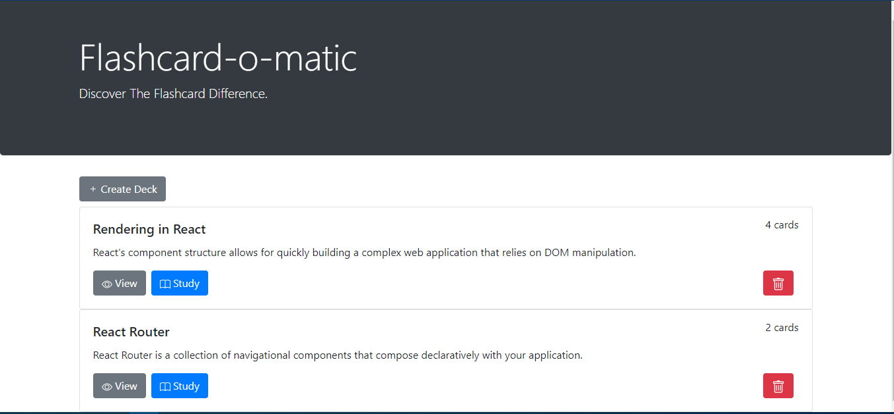
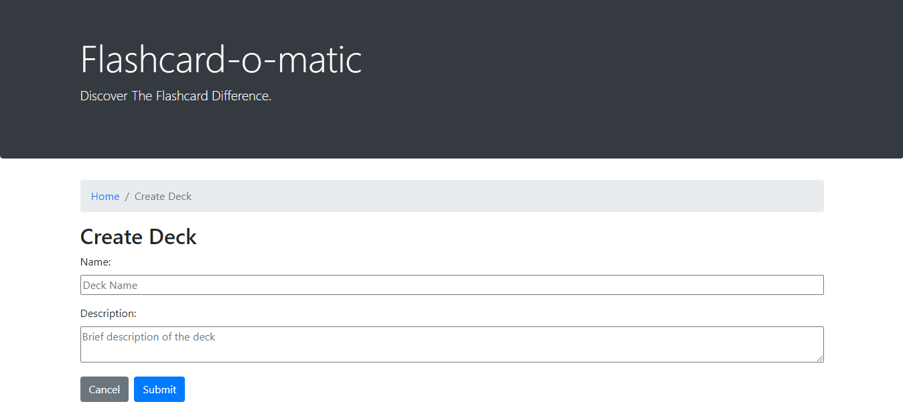
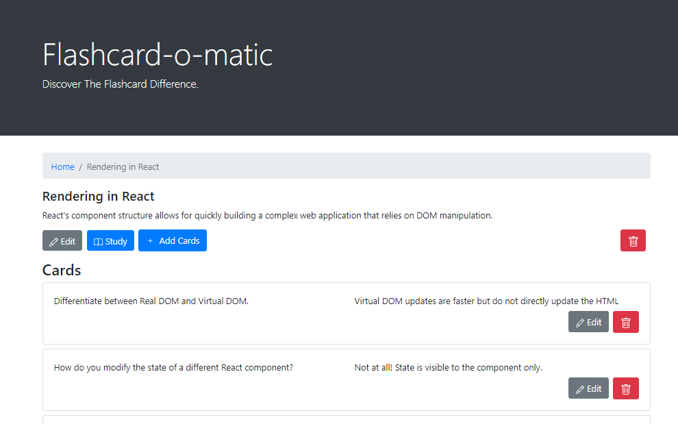
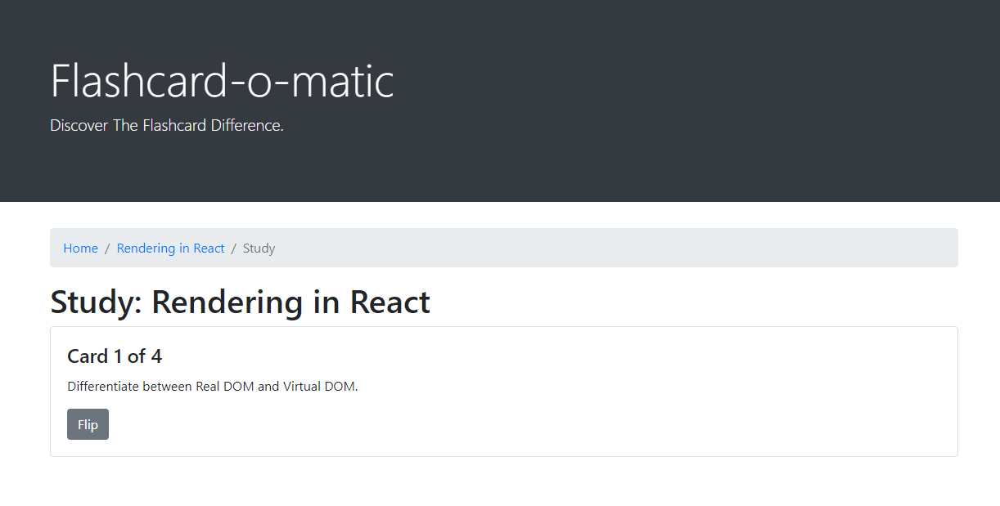

# Flashcard-o-matic App

This application can be used to create decks of flash cards to help study different subjects. The user can create deck or edit existing deck. When a new deck is created, at least 3 cards are required to start studying. There is an option to add new cards or edit existing cards.

 ## Links
 - [Vercel Deployment](https://flashcards-project-neon.vercel.app/) 
 
 ## Screenshots
 
### Home Page:

### Create New Deck:

### View Deck:

### Study Deck:
 
 
 ## Technology
 ### Built with:
 - React using hooks such as useEffect and useState
 - created with create-react-app

